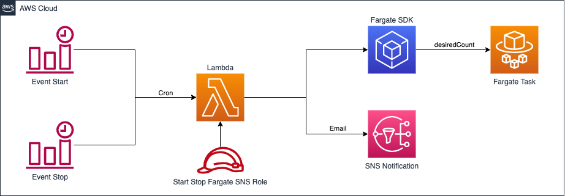

# Start Stop ECS Fargate Scheduler with SNS 

<p align="center">
  <a href="https://join.slack.com/t/yrisgroupe/shared_invite/zt-1q51z8dmv-GC0XzUSclzBnUQ0tpKhznw"></a>
  <a href="https://github.com/Yris-ops/start-stop-ecs-fargate-scheduler-sns"></a>
  <a href="https://github.com/Yris-ops/start-stop-ecs-fargate-scheduler-sns"></a>
  <a href="https://twitter.com/cz_antoine"></a>
  <a href="https://www.linkedin.com/in/antoine-cichowicz-837575b1"></a>
<p>



This CloudFormation template deploys a Lambda function that starts and stops Fargate tasks in an Amazon ECS cluster during non-business hours using AWS CloudWatch Events. The function is triggered by two rules, one for starting the tasks in the morning and one for stopping them in the evening. An SNS topic is used to send notifications to an email address specified in the template.

## Key Components

This CloudFormation template deploys the following key components:

- AWS Lambda function: A Node.js 16.x function that starts and stops Fargate tasks in an ECS cluster based on the triggers set by the CloudWatch Events rules. The function is triggered by two CloudWatch Events rules: one for starting the tasks in the morning and one for stopping them in the evening.
- CloudWatch Events rules: Two rules that trigger the Lambda function to start or stop the Fargate tasks in the ECS cluster during non-business hours. The rules use a cron expression to specify the schedule of the triggers.
- Amazon SNS topic: An SNS topic that sends a notification to the specified email address when the Lambda function starts or stops the Fargate tasks in the ECS cluster. The SNS topic is created as part of the CloudFormation stack.
- AWS Identity and Access Management (IAM) role: An IAM role that allows the Lambda function to perform actions on Amazon ECS and Amazon SNS. The role is created as part of the CloudFormation stack.
With these key components, this CloudFormation template provides a simple way to automate the start and stop of Fargate tasks in an ECS cluster during non-business hours.

## Parameters

The following parameters are required:

- EmailAddress: the email address to receive the notification
- ClusterRegion: the region where the ECS cluster is located
- ClusterECS: the name of the ECS cluster
- ServiceNameECS: the name of the ECS service
- ServiceECS: the name of the ECS task

## Usage

1. Open the AWS CloudFormation console.
1. Create a new stack and upload the `stack.yml` file.
1. Confirm SNS subscription and Enjoy.

## Testing the Lambda Function

To test the Lambda function, you can use the following example event:

``` json
{
  "status": "start",
  "ECS_CLUSTER": "<ClusterECS>",
  "ECS_SERVICE_NAME": "<ServiceNameECS>",
  "service": "<ServiceECS>"
}
```

You can test the function in the AWS Management Console by navigating to the Lambda service and selecting the `StatStopECSFargateSchedulerFunction`. Then, select the `Test` button and use the example event above.

Replace `<ClusterECS>`, `<ServiceNameECS>`, and `<ServiceECS>` with the values used in the CloudFormation stack parameters. This event will trigger the Lambda function to start the Fargate tasks in the specified ECS service.

You can use these example events to test the Lambda function in the AWS Management Console or wait for the CloudWatch Events rules to trigger the function during the specified schedule. When the function is triggered, it will start or stop the Fargate tasks in the specified ECS service and send a notification to the email address specified in the `EmailAddress` parameter.

## Limitation

The template assumes that there is only one ECS task running in the specified ECS service.

## Security

See [CONTRIBUTING](CONTRIBUTING.md#security-issue-notifications) for more information.

## License

This repository is licensed under the Apache License 2.0. See the LICENSE file.